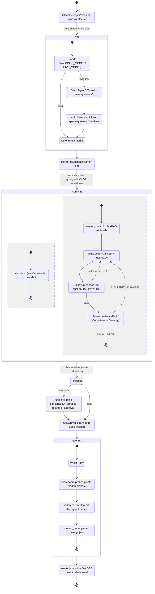

# Race State Machine

State machine for a single side (solo or hive) of the Hive Mind vs Solo
Agent demo, from `scripts/clean.sh` through final scoring. Both sides run
this lifecycle in parallel, synchronized at `WaitingAtGate` by the shared
`go.signal` barrier file written by `scripts/race.sh`.



## Notes

- **`Prep` is free.** Anything done here doesn't count against
  `*.duration` — that's the whole point of the barrier file.
- **`WaitingAtGate` is the fairness point.** Both sides idle on
  `go.signal` so neither gets a head start.
- **`Running` is where the two sides diverge.** Solo is a single shot.
  Hive is a guarded loop: retrieve → implement → self-check (budget
  gate) → byzantine vote (approval gate), with bounded retries on each
  gate.
- **`Consensus` only exists on the hive path.** It's the visible ruflo
  call that shows up in the live log panel after the claude session
  exits.
- **`Scoring` is identical for both sides.** That's what makes the
  comparison fair — same pipeline, same workspace layout, same probes.

---

# Hive Anatomy (what's actually happening inside `Running`)

The state machine above collapses the hive's `Running` state into a
black box. This second diagram opens that box. It shows the three ruflo
"superpowers" wired in by `scripts/hive.sh`, the MCP boundary between
the shell and the claude session, and the explicit 3-phase protocol the
claude session follows.

Colour key: grey = shell / filesystem, blue = ruflo CLI calls before
the starting gun, green = AgentDB + MCP surface, purple = inside the
claude session, orange = post-race ruflo call.

```mermaid
flowchart TB
    classDef shell  fill:#f3f4f6,stroke:#6b7280,color:#111
    classDef ruflo  fill:#dbeafe,stroke:#2563eb,color:#0b3b8c
    classDef store  fill:#dcfce7,stroke:#16a34a,color:#064e3b
    classDef claude fill:#ede9fe,stroke:#7c3aed,color:#3b1d80
    classDef post   fill:#ffedd5,stroke:#ea580c,color:#7c2d12

    subgraph PREP["PREP PHASE (free time, before go.signal)"]
        direction TB
        H[hive.sh]:::shell

        subgraph A["(A) RAG seeding"]
            direction TB
            REF1[reference/<br/>rate_limiter_gold.py]:::shell
            REF2[reference/<br/>edge_cases.md]:::shell
            REF3[reference/<br/>consensus_rubric.md]:::shell
            STORE[[ruflo memory store x3<br/>namespace=hive-gold]]:::ruflo
            REF1 --> STORE
            REF2 --> STORE
            REF3 --> STORE
        end

        subgraph B["(B) Topology registration"]
            direction TB
            INIT[[ruflo hive-mind init<br/>--topology hierarchical<br/>--consensus raft]]:::ruflo
            SPAWN[[ruflo hive-mind spawn<br/>--count 4<br/>--queen-type tactical<br/>--consensus weighted]]:::ruflo
            INIT --> SPAWN
        end

        AGENTDB[("AgentDB<br/>hive-gold namespace<br/>• rate-limiter-golden-pattern<br/>• rate-limiter-edge-cases<br/>• rate-limiter-consensus-rubric")]:::store
        TOPO[("Registered topology<br/>queen + 4 workers<br/>raft leader, weighted vote")]:::store

        H --> A
        H --> B
        STORE -- "ONNX 384-d vectors" --> AGENTDB
        SPAWN --> TOPO
    end

    GO{{go.signal written by race.sh<br/>— starting gun fires —}}:::shell
    H --> GO

    subgraph CLAUDE["RACE PHASE — inside claude -p session (HIVE_PROMPT)"]
        direction TB

        subgraph P1["PHASE 1 — RAG retrieval"]
            direction TB
            Q1{{"memory_search<br/>query='rate limiter<br/>golden pattern'<br/>namespace=hive-gold"}}:::claude
            HIT{Tool available<br/>AND hit?}:::claude
            FALLBACK[Read reference/<br/>files directly<br/>from disk]:::claude
            CTX[(In-context:<br/>golden pattern shape<br/>+ edge cases<br/>+ rubric)]:::claude
            Q1 --> HIT
            HIT -- yes --> CTX
            HIT -- no --> FALLBACK --> CTX
        end

        subgraph P2["PHASE 2 — Implement + self-verify (max 2 iterations)"]
            direction TB
            WRITE[Write src/rate_limiter.py<br/>+ src/test_rate_limiter.py<br/>in one pass]:::claude
            PYT[[pytest --cov<br/>→ coverage.json]]:::claude
            MET[[scoreboard/metrics.py<br/>→ metrics.json<br/>radon cc + throughput]]:::claude
            GATE{Gate:<br/>100% pass<br/>cov ≥ 80%<br/>ops ≥ 500k<br/>max_cc ≤ 5}:::claude
            FIX[Fix smallest<br/>failing thing]:::claude
            WRITE --> PYT --> MET --> GATE
            GATE -- fail<br/>iter ≤ 2 --> FIX --> PYT
            GATE -- pass<br/>or iter = 2 --> P3in([to Phase 3])
        end

        subgraph P3["PHASE 3 — 3-voter byzantine review"]
            direction TB
            V1[V1 Performance Engineer<br/>APPROVE|REJECT<br/>ops_per_sec + hot-path]:::claude
            V2[V2 Correctness Auditor<br/>APPROVE|REJECT<br/>tests + boundary + bool]:::claude
            V3[V3 Concurrency Reviewer<br/>APPROVE|REJECT<br/>lock + monotonic + memory]:::claude
            VOTE{Any REJECT<br/>with concrete fix?}:::claude
            REVISE[Apply fix<br/>re-run metrics<br/>re-vote ONCE]:::claude
            OUT[Final line:<br/>APPROVED<br/>or SHIPPED_WITH_REJECTS]:::claude
            V1 --> VOTE
            V2 --> VOTE
            V3 --> VOTE
            VOTE -- yes<br/>(once only) --> REVISE --> OUT
            VOTE -- no --> OUT
        end

        CTX --> WRITE
        P3in --> V1
        P3in --> V2
        P3in --> V3
    end

    GO --> P1

    subgraph POST["POST-RACE (visible ruflo consensus call)"]
        direction TB
        CONS[[ruflo hive-mind consensus<br/>--propose<br/>&quot;Approve final rate_limiter.py...&quot;]]:::post
        RESULT[(Consensus verdict<br/>logged to hive.log<br/>— audience-visible proof<br/>ruflo actually fired)]:::post
        CONS --> RESULT
    end

    OUT --> CONS
    TOPO -. "consensus runs against<br/>registered topology" .-> CONS

    AGENTDB -. "exposed to claude<br/>via MCP server<br/>(.mcp.json → claude-flow)" .-> Q1
```

## How to read this on stage

1. **Left-to-right, top-to-bottom = time.** Everything in `PREP` happens
   before the starting gun. Everything in `CLAUDE` is on the clock.
   `POST` is after the claude session exits.
2. **The green cylinders are real state.** `AgentDB` holds real ONNX
   384-d vectors; you can prove it live with
   `npx ruflo memory search --query "thread-safe sliding window"`.
   The topology registration is real ruflo internal state.
3. **The MCP boundary is the dotted arrow.** The claude session does
   not know about `hive.sh`, `ruflo`, or AgentDB directly — it only
   sees the `memory_search` tool exposed through the `claude-flow` MCP
   server declared in `.mcp.json`.
4. **Phase 1 has a fallback.** If the MCP tool is slow or empty, the
   prompt instructs claude to read the reference files from disk and
   move on. This is intentional — it keeps the demo robust without
   hiding the retrieval attempt.
5. **Phase 2's gate is why "tests pass" isn't enough.** The
   `metrics.py` budgets (`ops ≥ 500k`, `max_cc ≤ 5`) are the same
   numbers the scoreboard will grade against, so the hive is literally
   running a dry-run of the judge before shipping.
6. **Phase 3 is prose-as-protocol.** The 3 voters are role-played in a
   single claude turn, not separate processes. That's a design choice:
   it costs less than spawning 3 sub-agents and still forces the model
   to argue with itself against the retrieved rubric.
7. **`POST` is the honest part.** The orange box is the only ruflo
   consensus call that actually shows up in the live log during the
   race. Everything else is setup or prompt scaffolding. Calling this
   out on stage is what keeps the demo credible.

